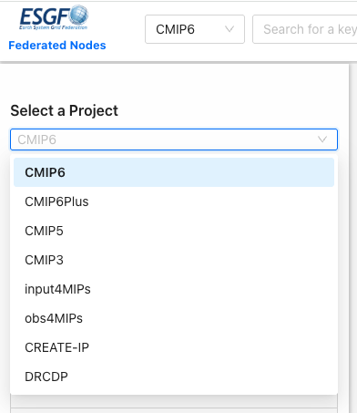

# Metagrid Guide

## What is Metagrid?

[Metagrid](https://aims2.llnl.gov/) is the next-generation search interface for the Earth System Grid Federation (ESGF). It's a user-friendly web application designed to help researchers find and access climate model data stored within the ESGF. Think of it as a more advanced way to search for and retrieve the data needed for climate research. You can access Metagrid [here](https://aims2.llnl.gov/).

## MetaGrid's Function:

MetaGrid is the tool that users interact with to search through the vast amount of data available through ESGF. It offers features like:

1. Facet Value Free-Text Entry: Allows users to quickly find relevant options by typing instead of scrolling through long lists of facets (like model names, variables, etc.).

2. Saved Searches: Users can save their search queries and reuse them later.
   Shareable Result Links: Enables users to share specific search results with colleagues.

3. How it helps:
   MetaGrid simplifies the process of finding the specific climate data needed for research, making it easier to access and utilize the data available through ESGF.

## How do I use this interface?

Here are the links for more information on the projects shown in the image above:

- `CMIP6`: [CMIP6 Data Info](https://pcmdi.llnl.gov/CMIP6/)
- `CMIP6Plus`: [CMIP6Plus Data Info](https://pcmdi.llnl.gov/CMIP6Plus/)
- `CMIP5`: [CMIP5 Data Info](https://pcmdi.llnl.gov/mips/cmip5/)
- `CMIP3`: [CMIP3 Data Info](https://pcmdi.llnl.gov/mips/cmip3/)
- `input4MIPs`: [input4MIPs Data Info](https://pcmdi.llnl.gov/mips/input4MIPs/)
- `Obs4MIPs`: [Obs4MIPs Data Info](https://pcmdi.github.io/obs4MIPs/dataOnESGF.html)
- `CREATE-IP`: [CREATE-IP Data Info](https://reanalyses.org/)
- `DRCDP`: [DRCDP Data Info](https://github.com/PCMDI/DRCDP)
